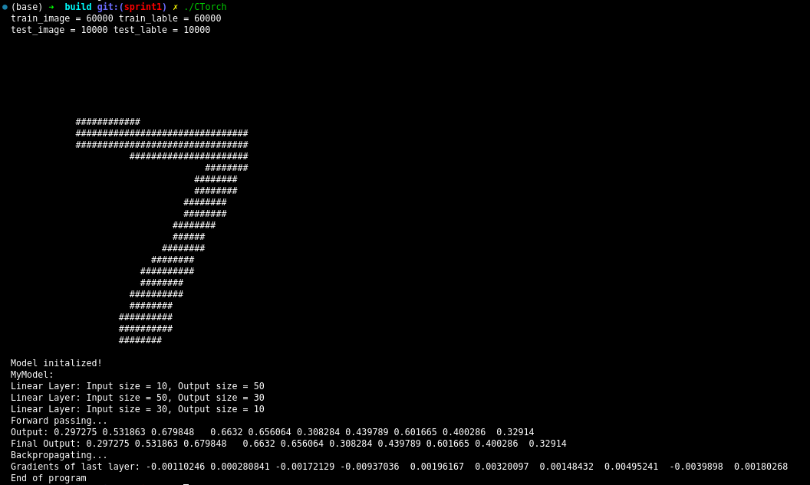

# CTorch Project

## Project Overview
CTorch is a C++-based tool designed for training and testing neural networks. The project leverages the Eigen library for efficient matrix operations and mathematical computations. It aims to provide a high-performance environment for neural network development.

Inspired by the [Deep Learning project](https://gitlab.lrz.de/tum-i05/public/advprog-project-ideas/-/blob/master/deep-learning/deep-learning.md?ref_type=heads).


## Dependencies

1. **C++ Standard**: Requires support for C++20 or later.

2. **Eigen Library**: The Eigen library must be downloaded and placed in the root directory of the project workspace.


### Download and Setup Eigen Library

1. **Download Eigen**:  You can download Eigen 3.4.0 release at [Eigen_3.4.0](https://gitlab.com/libeigen/eigen/-/releases/3.4.0)
2. **Extract Eigen**: Extract the downloaded `.zip` or `.tar.gz` file.
3. **Place Eigen**: Copy the `Eigen` in extracted folder `eigen-3.4.0` to Group-86 workspace(Ensure that you are in sprint1 branch). The structure should look like this:
   ```
   Group-86/
   ├── CMakeLists.txt
   ├── Data
   ├── datasets 
   ├── DataType
   ├── Eigen/  # Place the extracted Eigen library here
   └── ...
   ```

### Install a C++20-Compatible Compiler

#### Linux
- **GCC**: Install the latest version of GCC using your package manager. For example:
  ```bash
  sudo apt update
  sudo apt install g++-10
  ```
  Verify the installation:
  ```bash
  g++ --version
  ```
- **Clang**: Alternatively, you can install Clang:
  ```bash
  sudo apt install clang
  ```

#### macOS
- **Xcode**: Install Xcode from the App Store or use the command line tools:
  ```bash
  xcode-select --install
  ```
  Ensure your compiler supports C++20.

#### Windows
- **Visual Studio**: Install the latest version of Visual Studio and select the C++ development workload. Ensure that the MSVC compiler supports C++20.
- **MSYS2**: Alternatively, install GCC through MSYS2:
  ```bash
  pacman -S mingw-w64-x86_64-gcc
  ```


## Build and Run

### Build Steps
Run the following commands in a terminal to build and run the project:
```bash
mkdir build
cd build
cmake ..
make
```

### Running the Project
After successful compilation, execute the following command to run the program:
```bash
./CTorch
```
You can see the example output of the dummy network at the terminal:



## Feedback and Support
For any issues, please submit an issue or contact us via email.


